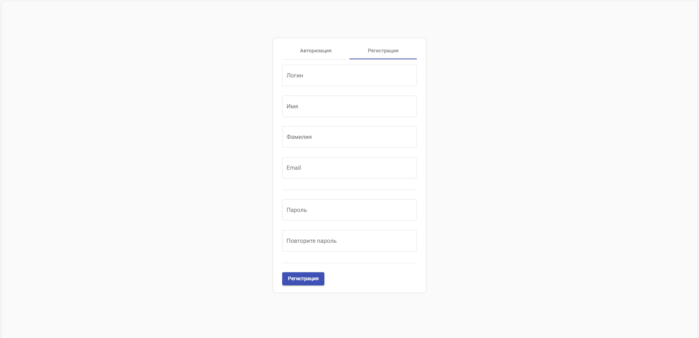
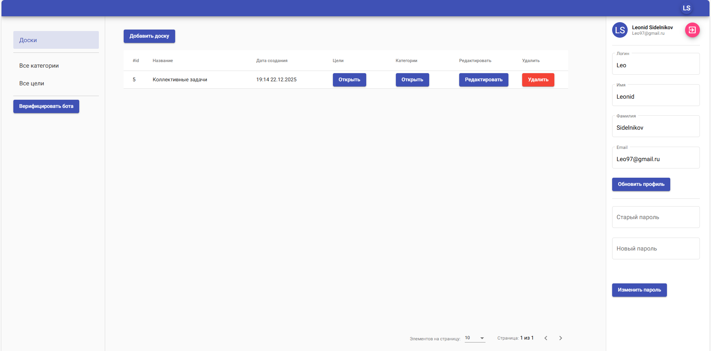
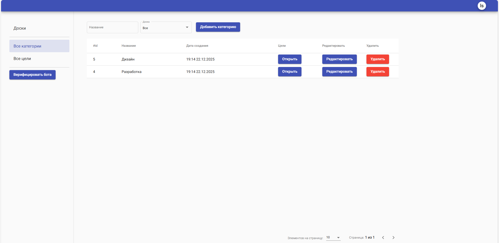
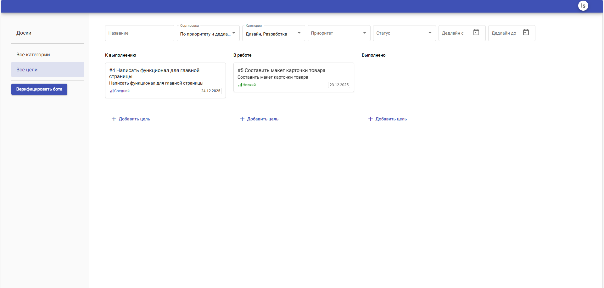

# Todolist — Персональный менеджер задач

Простой и удобный менеджер задач с Django бэкендом и React фронтендом. Предназначен для создания, редактирования и
отслеживания личных задач с возможностью авторизации и управления списками.

## Что реализовано в этом проекте

**API работает с моделями и базой данных PostgreSQL:**

- Реализованы модели пользователей, задач, категорий, досок для задач
- Возможность создавать, редактировать, отмечать как выполненные и удалять задачи
- Функционал комментариев для каждой задачи
- Поддержка приоритетов и дедлайнов для задач
- Пагинация и фильтрация задач по статусу и дате
- Реализована регистрация и авторизация пользователей
- Реализовано распределение ролей и соответствующих для них разрешений
- Присутствует возможность использования части функционала через телеграм бота
- Деплой посредством ci/cd

**Аутентификация:**

- Используются `BasicAuthentication` и `SessionAuthentication`
- Доступ к функционалу возможен только для авторизованных пользователей
- Доступ к чужим целям и доскам возможен только в случае предоставления прав владельцем
- Регистрация: POST /core/signup
- Логин: POST /core/login

**Тестирование:**

Проект включает автоматизированные тесты для моделей и API, запуск тестов:

```bash 
 pytest
```

## Примеры работы:

Регистрация пользователя по классическому принципу, с дублированием пароля.
После ввода корректных данных и нажатия кнопки регистрации, вход в профиль происходит сразу, автоматически.



После аутентификации пользователь попадает на страницу добавления досок для задач,
где полностью реализованно управление ими(создание, удаление, предоставление доступа другим пользователям).

Боковое меню редактирования профиля доступно на любой вкладке.



Экран категорий для целей, помимо функционала по управлению категориями присутствует фильтрация по взаимосвязанным
доскам.



Экран целей. На нем представлен функционал управления целями, широкий
спектр фильтров(по названию, категориям, статусу, дедлайну и тд.).
Каждая цель кликабельна и предоставляет возможность оставлять к ней комментарии.



## Как запустить:

```bash

# Клонируйте репозиторий
git clone https://github.com/Gevorgeorg/Todolist.git
```

```bash
 # Установка зависимостей
poetry install

 # Активация виртуального окружения
poetry shell
```

### Заполните .env файл (пример: .env.example)

```bash
# Применение миграций
python manage.py migrate

# Запуск сервера разработки
python manage.py runserver
```

### Быстрый запуск с Docker Compose

Проект полностью готов к запуску в контейнерах. Достаточно выполнить:

```bash
 #Сборка, применение миграций, подключение к образу фронтенда 

docker-compose up --build
```

### CI/CD — автоматический деплой

Проект настроен на автоматический деплой через GitHub Actions при пуше в ветку main:

При каждом коммите происходит сборка и деплой на сервер через SSH

#### Как использовать CI/CD:
Добавьте в Settings > Secrets and variables > Actions секреты:
- SERVER_HOST — IP или домен вашего сервера
- SERVER_USER — имя пользователя SSH
- SSH_PRIVATE_KEY — приватный ключ для доступа к серверу
- DOCKER_USERNAME — ваш логин в Docker Hub
- DOCKER_PASSWORD — токен Docker Hub
- и др. из env

После пуша - GitHub Action автоматически:
- Соберёт Docker-образы
- Отправит их на сервер
- Запустит контейнеры через docker-compose

